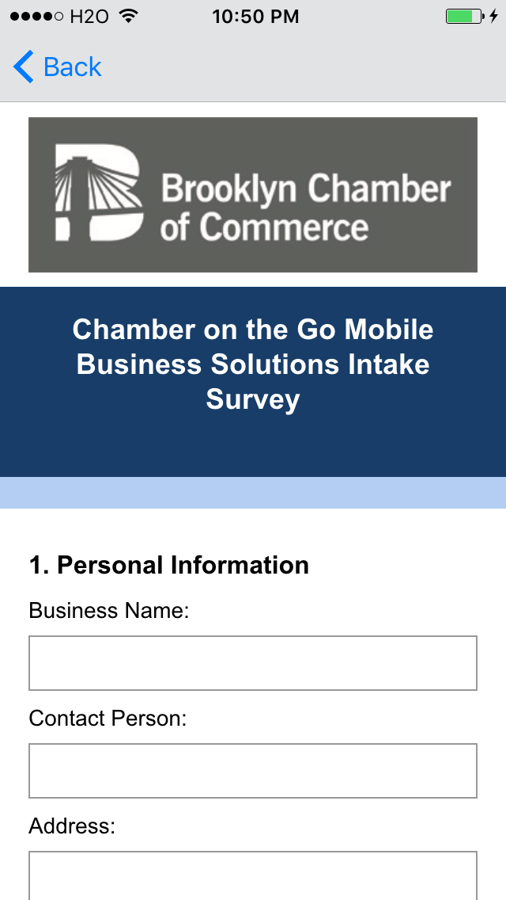

# GoDigital

**iOS version of application for Brooklyn Chamber of Commerce Internship**

The Brooklyn Chamber of Commerce is a membership-based organization, whose mission is to promote a healthy and robust business environment in Brooklyn.

The Brooklyn Alliance is the non-for-profit economic development affiliate of the Brooklyn Chamber, which works to address the needs of businesses through direct assistance programs like Chamber on the Go and Go Digital.

My internship consisted of designing and developing the Android and iOS versions of an application to allow these businesses to have access to the Chamber's services and online information all in one place and with the ease of a mobile application.

The applications were reviewed by a Google representative as part of Google's GYBO (Get Your Business Online) project.

Screenshots of app running on iOS device:

